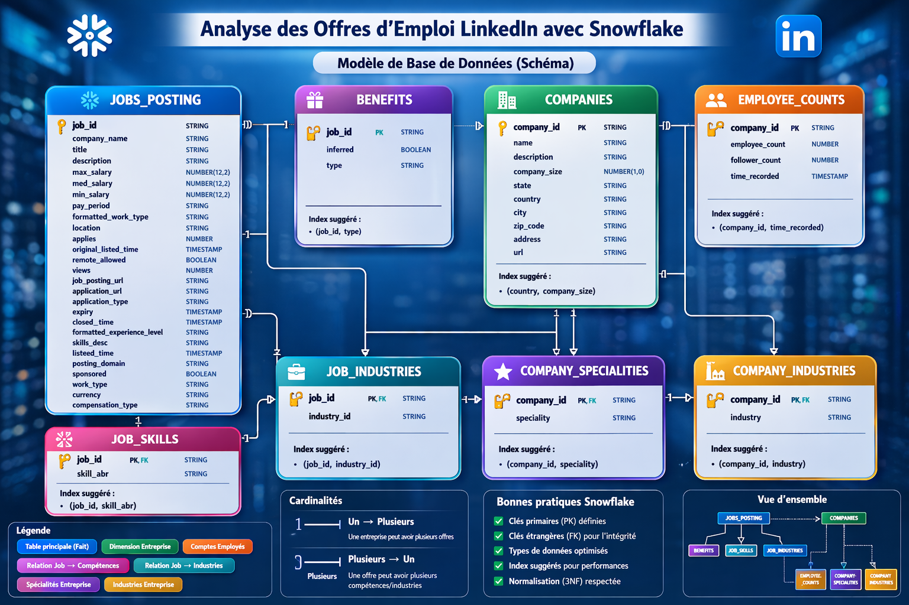
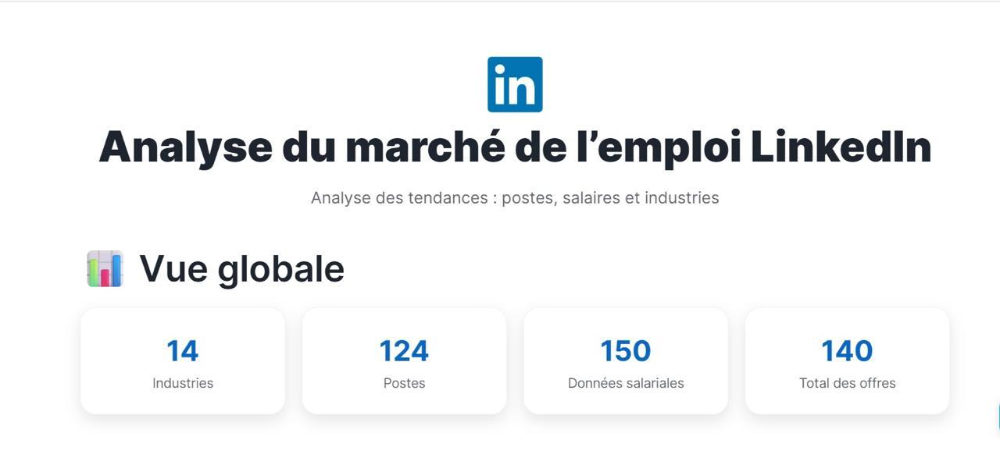
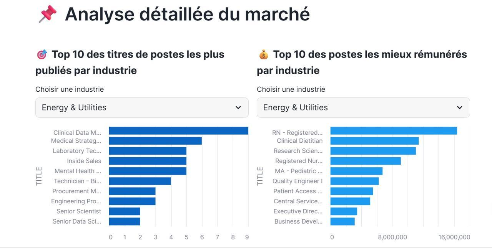
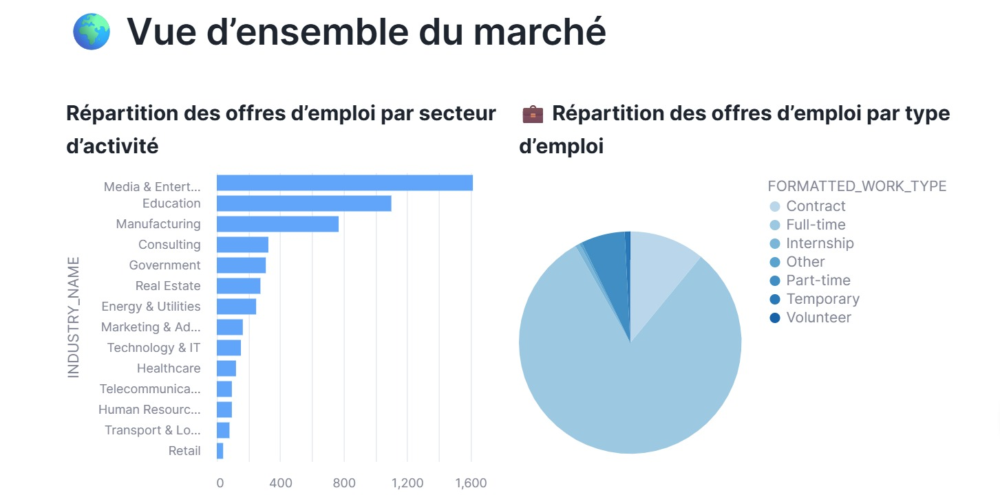
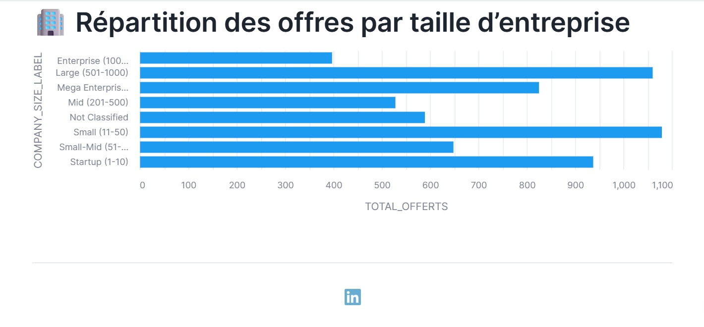

# 🧊 Lab — Analyse des Offres d’Emploi LinkedIn avec Snowflake

---

## 🎯 Objectif

Ce projet a pour objectif d’analyser les offres d’emploi issues de LinkedIn en utilisant Snowflake pour le traitement des données et Streamlit pour la visualisation.

L’objectif est de transformer des données brutes en indicateurs exploitables afin de comprendre les tendances du marché de l’emploi.

---

## 🏗️ Architecture des données

Le pipeline suit une architecture **Medallion** :

* **BRONZE** : ingestion des données brutes
* **SILVER** : nettoyage et transformation
* **GOLD** : données prêtes pour l’analyse

## 🧩 Modèle de données du projet LinkedIn

Voici la structure des tables utilisées dans ce projet.

Ce modèle représente les différentes entités du dataset LinkedIn et leurs relations, qui seront ensuite exploitées dans les couches Bronze, Silver et Gold.



---

# 🟫 1) BRONZE — Ingestion des données

## 🔹 Description

Cette étape consiste à charger les données brutes depuis un bucket S3 dans Snowflake sans transformation.

Nous utilisons :

* un stage externe
* des formats CSV et JSON
* la commande COPY INTO

---
```sql

-- =========================
-- DATABASE + SCHEMAS
-- =========================

-- Create database
CREATE DATABASE IF NOT EXISTS LINKEDIN;
USE DATABASE LINKEDIN;

-- Create schemas (Bronze / Silver / Gold)
CREATE SCHEMA IF NOT EXISTS BRONZE;
CREATE SCHEMA IF NOT EXISTS SILVER;
CREATE SCHEMA IF NOT EXISTS GOLD;

-- Use Bronze schema
USE SCHEMA BRONZE;

-- =========================
-- STAGE + FILE FORMATS
-- =========================

-- Create external stage (S3 bucket)
CREATE OR REPLACE STAGE linkedin_stage
URL = 's3://snowflake-lab-bucket/';

-- CSV file format definition
CREATE OR REPLACE FILE FORMAT csv_format
TYPE = CSV
SKIP_HEADER = 1
FIELD_OPTIONALLY_ENCLOSED_BY = '"'
ERROR_ON_COLUMN_COUNT_MISMATCH = FALSE;

-- JSON file format definition
CREATE OR REPLACE FILE FORMAT json_format
TYPE = JSON;

-- =========================
-- BRONZE TABLES (RAW DATA)
-- =========================

-- Set context
USE SCHEMA BRONZE;

-- =========================
-- JOB_POSTINGS TABLE
-- =========================

-- Create raw job postings table
CREATE OR REPLACE TABLE JOB_POSTINGS (
    job_id STRING,
    company_name STRING,
    title STRING,
    description STRING,
    max_salary STRING,
    min_salary STRING,
    med_salary STRING,
    pay_period STRING,
    formatted_work_type STRING,
    location STRING,
    applies STRING,
    views STRING,
    formatted_experience_level STRING,
    work_type STRING,
    currency STRING,
    compensation_type STRING,
    original_listed_time STRING,
    expiry STRING,
    closed_time STRING,
    remote_allowed STRING,
    job_posting_url STRING,
    application_url STRING,
    application_type STRING,
    posting_domain STRING,
    sponsored STRING
);

-- Load CSV data into JOB_POSTINGS
COPY INTO JOB_POSTINGS
FROM @linkedin_stage/job_postings.csv
FILE_FORMAT = csv_format
ON_ERROR = 'CONTINUE';

-- Check data
SELECT * FROM JOB_POSTINGS;

-- =========================
-- COMPANIES TABLE
-- =========================

-- Create raw companies table (JSON)
CREATE OR REPLACE TABLE COMPANIES (data VARIANT);

-- Load JSON data
COPY INTO COMPANIES
FROM @linkedin_stage/companies.json
FILE_FORMAT = json_format;

-- Check data
SELECT * FROM COMPANIES;

-- =========================
-- JOB INDUSTRIES RAW
-- =========================

-- Create raw job industries table
CREATE OR REPLACE TABLE JOB_INDUSTRIES_RAW (data VARIANT);

-- Load JSON data
COPY INTO JOB_INDUSTRIES_RAW
FROM @linkedin_stage/job_industries.json
FILE_FORMAT = json_format;

-- Check data
SELECT * FROM JOB_INDUSTRIES_RAW;

-- =========================
-- BENEFITS TABLE
-- =========================

-- Create benefits table
CREATE OR REPLACE TABLE bronze_benefits (
job_id STRING,
inferred STRING,
type STRING
);

-- Load benefits data
COPY INTO bronze_benefits
FROM @linkedin_stage/benefits.csv
FILE_FORMAT = csv_format;

-- Check data
SELECT * FROM bronze_benefits;

-- =========================
-- EMPLOYEE COUNTS TABLE
-- =========================

-- Create employee counts table
CREATE OR REPLACE TABLE bronze_employee_counts (
company_id STRING,
employee_count STRING,
follower_count STRING,
time_recorded STRING
);

-- Load employee data
COPY INTO bronze_employee_counts
FROM @linkedin_stage/employee_counts.csv
FILE_FORMAT = csv_format;

-- Check data
SELECT * FROM bronze_employee_counts;

-- =========================
-- JOB SKILLS TABLE
-- =========================

-- Create job skills table
CREATE OR REPLACE TABLE bronze_job_skills (
job_id STRING,
skill_abr STRING
);

-- Load skills data
COPY INTO bronze_job_skills
FROM @linkedin_stage/job_skills.csv
FILE_FORMAT = csv_format;

-- Check data
SELECT * FROM bronze_job_skills;

-- =========================
-- COMPANY SPECIALITIES
-- =========================

-- Create table (JSON raw)
CREATE OR REPLACE TABLE linkedin.bronze.company_specialities (
    data variant
);

-- Load data
COPY INTO linkedin.bronze.company_specialities
FROM @linkedin.bronze.linkedin_stage/company_specialities.json
FILE_FORMAT = (type = 'json');

-- Check data
SELECT * FROM linkedin.bronze.company_specialities;

-- =========================
-- COMPANY INDUSTRIES
-- =========================

-- Create table (JSON raw)
CREATE OR REPLACE TABLE linkedin.bronze.company_industries (
    data variant
);

-- Load data
COPY INTO linkedin.bronze.company_industries
FROM @linkedin.bronze.linkedin_stage/company_industries.json
FILE_FORMAT = (type = 'json');

-- Check data
SELECT * FROM linkedin.bronze.company_industries;
```


# ⚪ 2) SILVER — Nettoyage des données

## 🔹 Description

Cette étape permet de nettoyer et transformer les données afin de les rendre exploitables.


```sql
-- =========================
-- SILVER LAYER (CLEAN DATA)
-- =========================

-- Create companies clean table

CREATE OR REPLACE TABLE SILVER.COMPANIES_CLEAN AS
SELECT
    TRIM(TO_VARCHAR(f.value:"company_id")) AS company_id,
    TRIM(f.value:"name") AS company_name,

    -- numeric company size
    f.value:"company_size"::NUMBER AS company_size,

    -- company size label
    CASE
        WHEN f.value:"company_size"::NUMBER BETWEEN 0 AND 1 THEN 'Startup (1-10)'
        WHEN f.value:"company_size"::NUMBER = 2 THEN 'Small (11-50)'
        WHEN f.value:"company_size"::NUMBER = 3 THEN 'Small-Mid (51-200)'
        WHEN f.value:"company_size"::NUMBER = 4 THEN 'Mid (201-500)'
        WHEN f.value:"company_size"::NUMBER = 5 THEN 'Large (501-1000)'
        WHEN f.value:"company_size"::NUMBER = 6 THEN 'Enterprise (1001-5000)'
        WHEN f.value:"company_size"::NUMBER >= 7 THEN 'Mega Enterprise (5000+)'
        ELSE 'Not Classified'
    END AS company_size_label

FROM BRONZE.COMPANIES,
LATERAL FLATTEN(input => data) f;

-- Check table
SELECT * FROM SILVER.COMPANIES_CLEAN;


-- =========================
-- JOB POSTINGS CLEAN
-- =========================

CREATE OR REPLACE TABLE SILVER.JOB_POSTINGS AS
SELECT
    job_id,
    TRIM(title) AS title,
    TRIM(company_name) AS company_id,
    location,
    formatted_work_type,
    formatted_experience_level,

    -- clean salary
    TRY_TO_NUMBER(REGEXP_REPLACE(max_salary, '[^0-9]', '')) AS max_salary,

    -- yearly salary conversion
    CASE
        WHEN LOWER(pay_period) = 'hourly'
            THEN TRY_TO_NUMBER(REGEXP_REPLACE(max_salary, '[^0-9]', '')) * 2080
        WHEN LOWER(pay_period) = 'monthly'
            THEN TRY_TO_NUMBER(REGEXP_REPLACE(max_salary, '[^0-9]', '')) * 12
        ELSE TRY_TO_NUMBER(REGEXP_REPLACE(max_salary, '[^0-9]', ''))
    END AS max_salary_yearly

FROM BRONZE.JOB_POSTINGS;

-- Check table
SELECT * FROM SILVER.JOB_POSTINGS;


-- =========================
-- JOB INDUSTRIES CLEAN
-- =========================

CREATE OR REPLACE TABLE SILVER.JOB_INDUSTRIES AS
SELECT
    f.value:"job_id"::STRING AS job_id,
    f.value:"industry_id"::STRING AS industry_id
FROM BRONZE.JOB_INDUSTRIES_RAW,
LATERAL FLATTEN(input => data) f;

-- Check table
SELECT * FROM SILVER.JOB_INDUSTRIES;


-- =========================
-- JOB + COMPANY JOIN
-- =========================

CREATE OR REPLACE TABLE SILVER.JOB_ENRICHED AS
SELECT
    jp.*,
    c.company_name
FROM SILVER.JOB_POSTINGS jp
LEFT JOIN SILVER.COMPANIES_CLEAN c
    ON jp.company_id = c.company_id;

-- Check table
SELECT * FROM SILVER.JOB_ENRICHED;
```


# 🟨 3) GOLD — Analytics 

## 🔹 Description

Cette couche contient :

 Cette couche correspond à la couche "métier" du projet.
 Elle contient des tables prêtes pour l’analyse et la visualisation.
 Les données sont agrégées et organisées pour répondre directement aux questions du TP.


```sql
-- =========================================================
-- DIMENSION INDUSTRY
-- =========================================================
-- Nous avons commencé par créer une table de dimension industrie.
-- Cette table sert à transformer les industry_id (non lisibles)
-- en noms d’industries compréhensibles (ex: IT, Finance, Healthcare).
-- Elle sera utilisée dans toutes les analyses par secteur.

CREATE OR REPLACE TABLE GOLD.DIM_INDUSTRY AS
SELECT DISTINCT
    industry_id,

    CASE industry_id
        WHEN '1' THEN 'Technology & IT'
        WHEN '2' THEN 'Financial Services'
        WHEN '3' THEN 'Healthcare'
        WHEN '4' THEN 'Education'
        WHEN '5' THEN 'Retail'
        WHEN '6' THEN 'Manufacturing'
        WHEN '7' THEN 'Telecommunications'
        WHEN '8' THEN 'Consulting'
        WHEN '9' THEN 'Marketing & Advertising'
        WHEN '10' THEN 'Transport & Logistics'
        WHEN '11' THEN 'Real Estate'
        WHEN '12' THEN 'Energy & Utilities'
        WHEN '13' THEN 'Human Resources'
        WHEN '14' THEN 'Media & Entertainment'
        WHEN '15' THEN 'Government'
        ELSE 'NOT CLASSIFIED'
    END AS industry_name
FROM SILVER.JOB_INDUSTRIES;


-- =========================================================
-- JOB ↔ INDUSTRY LINKING TABLE
-- =========================================================
-- Ensuite, nous avons créé une table de liaison entre les jobs et leurs industries.
-- Cela permet d’associer chaque offre d’emploi à un secteur précis.
-- Cette étape est essentielle pour toutes les analyses par industrie.

CREATE OR REPLACE TABLE GOLD.JOB_INDUSTRY AS
SELECT
    ji.job_id,
    di.industry_name
FROM SILVER.JOB_INDUSTRIES ji
LEFT JOIN GOLD.DIM_INDUSTRY di
    ON ji.industry_id = di.industry_id;


-- =========================================================
-- ANALYSE 1 : TOP 10 TITRES DE POSTES PAR INDUSTRIE
-- =========================================================
-- Objectif : comprendre quels sont les postes les plus demandés dans chaque secteur.
-- Cette analyse permet d’identifier les tendances du marché de l’emploi par industrie.

CREATE OR REPLACE TABLE GOLD.TOP_JOBS_BY_INDUSTRY AS
SELECT *
FROM (
    SELECT
        ji.industry_name,
        je.title,
        COUNT(*) AS total_jobs,

        ROW_NUMBER() OVER (
            PARTITION BY ji.industry_name
            ORDER BY COUNT(*) DESC
        ) AS rn

    FROM SILVER.JOB_ENRICHED je
    JOIN GOLD.JOB_INDUSTRY ji
        ON je.job_id = ji.job_id
    GROUP BY ji.industry_name, je.title
)
WHERE rn <= 10;


-- =========================================================
-- ANALYSE 2 : TOP 10 SALAIRES PAR INDUSTRIE
-- =========================================================
-- Objectif : identifier les postes les mieux rémunérés dans chaque secteur.
-- Cela permet d’analyser les opportunités financières par industrie.

CREATE OR REPLACE TABLE GOLD.TOP_SALARIES_BY_INDUSTRY AS
SELECT *
FROM (
    SELECT
        ji.industry_name,
        je.title,
        je.max_salary_yearly,

        ROW_NUMBER() OVER (
            PARTITION BY ji.industry_name
            ORDER BY je.max_salary_yearly DESC NULLS LAST
        ) AS rn

    FROM SILVER.JOB_ENRICHED je
    JOIN GOLD.JOB_INDUSTRY ji
        ON je.job_id = ji.job_id
    WHERE je.max_salary_yearly IS NOT NULL
)
WHERE rn <= 10;


-- =========================================================
-- ANALYSE 3 : RÉPARTITION DES OFFRES PAR INDUSTRIE
-- =========================================================
-- Objectif : analyser quels secteurs publient le plus d’offres d’emploi.
-- Cela permet d’identifier les industries les plus actives sur le marché.

CREATE OR REPLACE TABLE GOLD.INDUSTRY_DISTRIBUTION AS
SELECT
    industry_name,
    COUNT(*) AS total_jobs
FROM GOLD.JOB_INDUSTRY
GROUP BY industry_name;


-- =========================================================
-- ANALYSE 4 : RÉPARTITION PAR TAILLE D’ENTREPRISE
-- =========================================================
-- Objectif : comprendre quelles tailles d’entreprises recrutent le plus.
-- Cela permet de distinguer startups, PME et grandes entreprises.

CREATE OR REPLACE TABLE GOLD.COMPANY_SIZE AS
SELECT
    company_size_label,
    COUNT(*) AS total_offerts
FROM SILVER.COMPANIES_CLEAN
GROUP BY company_size_label;


-- =========================================================
-- ANALYSE 5 : RÉPARTITION PAR TYPE D’EMPLOI
-- =========================================================
-- Objectif : analyser les types de contrats les plus proposés
-- (full-time, part-time, contract, etc.).
-- Cela permet de comprendre la structure du marché de l’emploi.

CREATE OR REPLACE TABLE GOLD.WORK_TYPE AS
SELECT
    formatted_work_type,
    COUNT(*) AS total_jobs
FROM SILVER.JOB_ENRICHED
GROUP BY formatted_work_type;
```


## 🟢 4) STREAMLIT — Dashboard interactif

## 🔹 Description

Cette étape consiste à construire un dashboard interactif avec Streamlit afin de visualiser les résultats du pipeline Snowflake.

Nous connectons directement Streamlit à Snowflake (via Snowpark) pour interroger les tables Gold et créer des visualisations dynamiques.

Le dashboard permet d’analyser :

les tendances des métiers par industrie
les salaires les plus élevés
la répartition des industries
les types de contrats
la taille des entreprises

```sql
import streamlit as st
import altair as alt
from snowflake.snowpark.context import get_active_session

# =========================
# CONFIGURATION DE LA PAGE
# =========================
st.set_page_config(
    page_title="Analyse des emplois LinkedIn",
    layout="wide",
    initial_sidebar_state="expanded"
)

# =========================
# STYLE CSS (UI du dashboard)
# =========================
st.markdown("""
<style>

.main-title {
    font-size: 42px;
    font-weight: 800;
    text-align: center;
    color: var(--text-color);
    margin-bottom: 5px;
}

.sub-title {
    text-align: center;
    color: var(--text-color);
    opacity: 0.7;
    font-size: 16px;
    margin-bottom: 20px;
}

.kpi-card {
    background: var(--secondary-background-color);
    padding: 20px;
    border-radius: 16px;
    text-align: center;
    box-shadow: 0 6px 15px rgba(0,0,0,0.1);
    border: 1px solid rgba(0,0,0,0.05);
}

.kpi-value {
    font-size: 28px;
    font-weight: 700;
    color: #0A66C2;
}

.kpi-label {
    color: var(--text-color);
    opacity: 0.7;
    font-size: 13px;
}

.section-title {
    font-size: 20px;
    font-weight: 700;
    color: var(--text-color);
    margin-top: 25px;
    margin-bottom: 10px;
}

</style>
""", unsafe_allow_html=True)


# =========================
# HEADER DU DASHBOARD
# =========================
# Affichage du logo LinkedIn + titre principal

st.markdown("""
<div style="text-align:center; margin-top:10px;">
    
</div>
""", unsafe_allow_html=True)

st.markdown("""
<div class="main-title">Analyse du marché de l’emploi LinkedIn</div>
<div class="sub-title">Analyse des tendances : postes, salaires et industries</div>
""", unsafe_allow_html=True)


# =========================
# CONNEXION SNOWFLAKE (SESSION ACTIVE)
# =========================
session = get_active_session()

# =========================
# CHARGEMENT DES DONNÉES GOLD
# =========================
jobs = session.sql("SELECT * FROM GOLD.TOP_JOBS_BY_INDUSTRY").to_pandas()
salary = session.sql("SELECT * FROM GOLD.TOP_SALARIES_BY_INDUSTRY").to_pandas()
industry_dist = session.sql("SELECT * FROM GOLD.INDUSTRY_DISTRIBUTION").to_pandas()
company_size = session.sql("SELECT * FROM GOLD.COMPANY_SIZE").to_pandas()
work_type = session.sql("SELECT * FROM GOLD.WORK_TYPE").to_pandas()

# =========================
# NETTOYAGE RAPIDE DES DONNÉES
# =========================
jobs = jobs[~jobs["INDUSTRY_NAME"].str.contains("NOT CLASSIFIED|OTHER", na=False)]
industry_dist = industry_dist[~industry_dist["INDUSTRY_NAME"].str.contains("NOT CLASSIFIED|OTHER", na=False)]


# =========================
# KPI PRINCIPAUX
# =========================
st.markdown("## 📊 Vue globale")

c1, c2, c3, c4 = st.columns(4)

kpis = [
    ("Industries", jobs["INDUSTRY_NAME"].nunique()),
    ("Postes", jobs["TITLE"].nunique()),
    ("Données salariales", len(salary)),
    ("Total des offres", len(jobs))
]

for col, (label, value) in zip([c1, c2, c3, c4], kpis):
    col.markdown(f"""
    <div class="kpi-card">
        <div class="kpi-value">{value}</div>
        <div class="kpi-label">{label}</div>
    </div>
    """, unsafe_allow_html=True)
st.markdown("<div style='margin-top:50px;'></div>", unsafe_allow_html=True)


```
### 🔹 Vue globale des indicateurs métiers



```sql
# =========================
# ANALYSE 1 : JOBS PAR INDUSTRIE
# =========================
# Objectif : identifier les postes les plus publiés par secteur
# Cela permet de comprendre les besoins du marché par industrie
st.markdown("## 📌 Analyse détaillée du marché")

col1, col2 = st.columns(2)

with col1:
    st.markdown('<div class="section-title">🎯 Top 10 des titres de postes les plus publiés par industrie</div>', unsafe_allow_html=True)

    industry_job = st.selectbox(
        "Choisir une industrie",
        sorted(jobs["INDUSTRY_NAME"].unique())
    )

    filtered_jobs = jobs[jobs["INDUSTRY_NAME"] == industry_job]
    top_jobs = filtered_jobs.sort_values("TOTAL_JOBS", ascending=False).head(10)

    chart_jobs = alt.Chart(top_jobs).mark_bar(color="#0A66C2").encode(
        x="TOTAL_JOBS:Q",
        y=alt.Y("TITLE:N", sort="-x"),
        tooltip=["TITLE", "TOTAL_JOBS"]
    )

    st.altair_chart(chart_jobs, use_container_width=True)
# =========================
# ANALYSE 2 : SALAIRES
# =========================
# Objectif : analyser les postes les mieux rémunérés par secteur
# Cela permet d’identifier les industries les plus attractives financièrement

with col2:
    st.markdown('<div class="section-title">💰 Top 10 des postes les mieux rémunérés par industrie</div>', unsafe_allow_html=True)

    industry_salary = st.selectbox(
        "Choisir une industrie",
        sorted(salary["INDUSTRY_NAME"].unique()),
        key="salary"
    )

    filtered_salary = salary[salary["INDUSTRY_NAME"] == industry_salary]
    top_salary = filtered_salary.sort_values("MAX_SALARY_YEARLY").tail(10)

    chart_salary = alt.Chart(top_salary).mark_bar(color="#1D9BF0").encode(
        x="MAX_SALARY_YEARLY:Q",
        y=alt.Y("TITLE:N", sort="-x"),
        tooltip=["TITLE", "MAX_SALARY_YEARLY"]
    )

    st.altair_chart(chart_salary, use_container_width=True)

```
### 🔹 Analyse du Marché

###  Top 10 des titres de postes les plus publiés par industrie.

###  Top 10 des postes les mieux rémunérés par industrie.

### 



```sql

# =========================
# VUE GLOBALE DU MARCHÉ
# =========================

# ==============================
# ANALYSE 3 : RÉPARTITION DES INDUSTRIES
#==============================

# Objectif : analyser la distribution des offres d’emploi par secteur

st.markdown("## 🌍 Vue d’ensemble du marché")

c1, c2 = st.columns(2)

with c1:
    st.markdown('<div class="section-title">Répartition des offres d’emploi par secteur d’activité</div>', unsafe_allow_html=True)

    chart_industry = alt.Chart(industry_dist).mark_bar(color="#60A5FA").encode(
        x="TOTAL_JOBS:Q",
        y=alt.Y("INDUSTRY_NAME:N", sort="-x")
    )

    st.altair_chart(chart_industry, use_container_width=True)


# ==============================
# ANALYSE 4 : TYPES D EMPLOI 
# ==============================


with c2:
    st.markdown('<div class="section-title">💼 Répartition des offres d’emploi par type d’emploi</div>', unsafe_allow_html=True)

    pie = alt.Chart(work_type).mark_arc().encode(
        theta="TOTAL_JOBS:Q",
        color=alt.Color("FORMATTED_WORK_TYPE:N", scale=alt.Scale(scheme="blues")),
        tooltip=["FORMATTED_WORK_TYPE", "TOTAL_JOBS"]
    )

    st.altair_chart(pie, use_container_width=True)


```
### 🔹 Vue d'ensemble du Marché

###  Répartition des offres d’emploi par secteur d’activité.

###  Répartition des offres d’emploi par type d’emploi (temps plein, stage, temps partiel).



```sql


# =========================
# TAILLE DES ENTREPRISES
# =========================
st.markdown("## 🏢 Répartition des offres par taille d’entreprise")

company_size = company_size.sort_values("TOTAL_OFFERTS")

chart_company = alt.Chart(company_size).mark_bar(color="#1D9BF0").encode(
    x="TOTAL_OFFERTS:Q",
    y="COMPANY_SIZE_LABEL:N"
)

st.altair_chart(chart_company, use_container_width=True)

# =========================
# FOOTER
# =========================
st.markdown("---")

st.markdown("""
<div style="text-align:center; opacity:0.6;">
    
</div>
""", unsafe_allow_html=True)

```

### 🔹 Répartition par tailles d'entreprises




